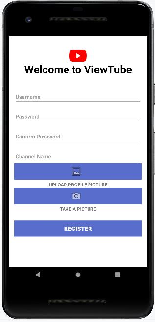
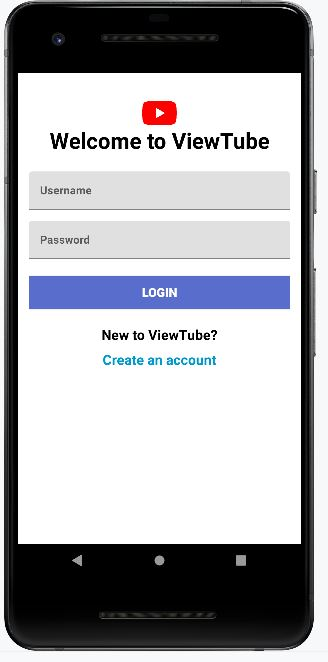
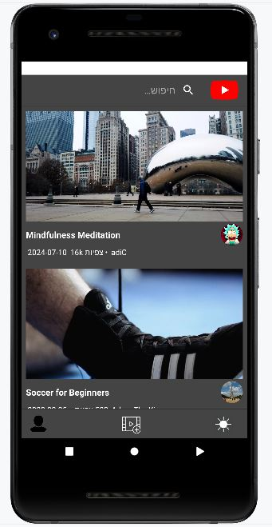
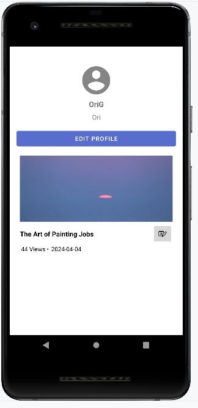

# ViewTube - Android App
ViewTube is an Android application that allows users to explore and watch videos, similar to popular video-sharing platforms. 
This app connects to a MongoDB database to handle user data, video uploads, and recommendations.

# Features

## User Registration & Login
Secure authentication using JWT tokens to manage user sessions.

## Video Viewing
Users can watch a variety of videos with an intuitive interface.

dark mode exists.

## Video Recommendations
Video recommendations based on behavior and views.

## User-Generated Content
Users can upload and manage their own videos.

## User Profiles
Each user has a profile showcasing their uploaded videos and activity.

# Technologies
Android: Built with Java using Android Studio.
MongoDB: NoSQL database to store user and video data.
Node.js: Backend server to manage API requests and handle database interactions.
JWT: For secure user authentication and session management.

## Usage
## Register a New Account:
Open the app and create a new user account.
## Log In:
Use your registered credentials to log in.
## Explore Videos:
Browse the available videos or search for specific content.
## Upload Videos:
Users can upload their own videos from their device.