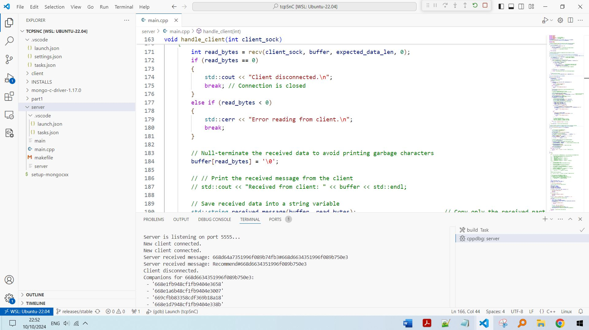
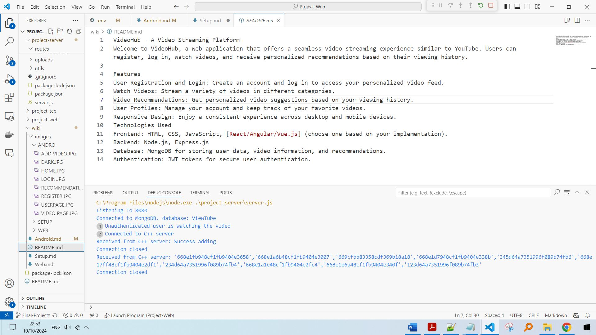

first, clone the repository
```
git clone https://github.com/OriGuez/Project-Web.git
cd project-web
```

Then, you will need to set up 2 servers: the NodeJS and the CPP servers.

## Setting up the NodeJs Server:

## Filling details in .env file
please fill the .env file (which is inside the config folder in project-server). its made of 5 fields:
* PORT=
* MONGO_URI=""
* ACCESS_TOKEN_SECRET=""
* TCP_HOST=""
* TCP_PORT=""

#### ACCESS_TOKEN_SECRET is the secret key of jwt token.
#### PORT is the port the server will run on.

#### the mongo_URI should include the database name of ViewTube for consistency.
for example "mongodb://localhost:xxxxx/ViewTube".
  if you have username and password for the mongoDB server you should insert them too.

## Initialize data on The Server
We've created a script that initializes the database with 30 videos, 10 users and some comments.
- to run the script first put in the config/.env file the mongo URI including the database name (as mentioned above).
- Then, start the terminal on "project-server/initData" folder and hit
```
node initData.js
```
- The media (actual videos and images) is already in the "uploads" folder.
#### now the DB is full.

## Running The Server
first, make sure that you've filled the .env file.
Then, please install the dependencies using
```
npm install
```
on both project-server and project-web folders. (although project-web isnt neccesary to run the server because its build is sitting in "public" folder in project-server).
In order to run the server you need to go to the terminal on project-server directory and hit
```
node server.js
```
now go to the address and see the website.

## Setting up the CPP Server:
first of all, the server must run on linux. (was tested on WSL Ubuntu 22.04)

you need to install mongoDB dependencies on it such as MONGOSH and 
```
sudo service mongod start
```
there is a makefile there if you want to make changes. so you can use
```
make
```
and then 
```
./main
```
to run it.

make sure that the mongoDB service is running.
```
mongosh --host XXX.X.X.X --port XXXXX ViewTube
```


eventually there should be the 2 servers running together.



