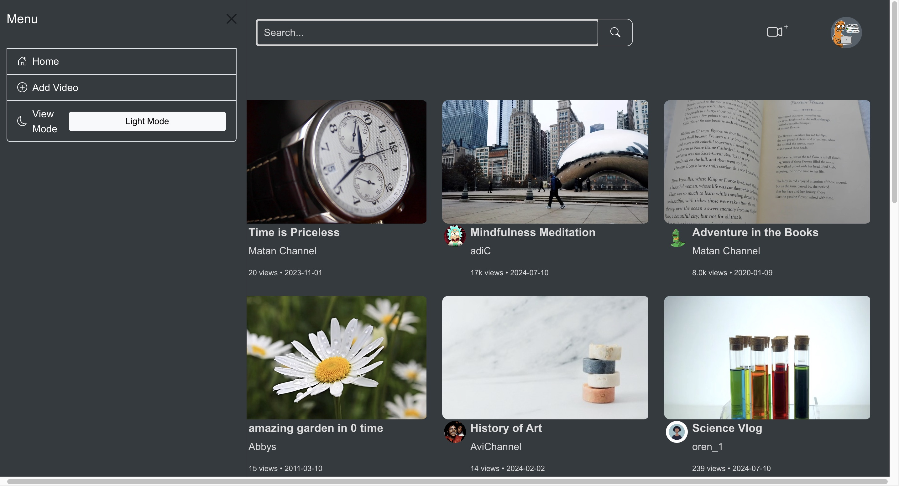
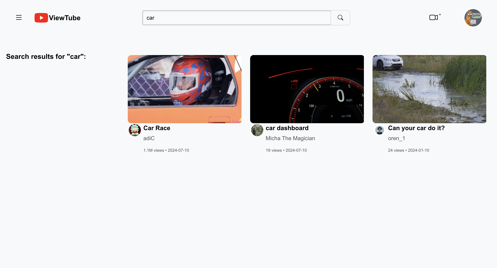
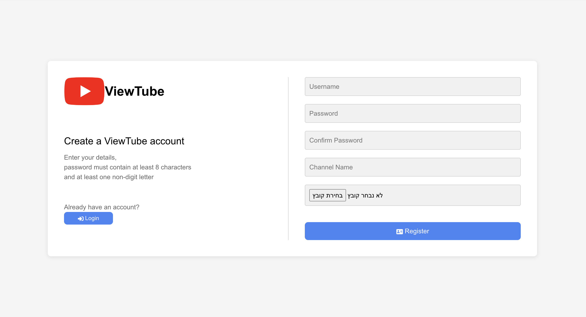
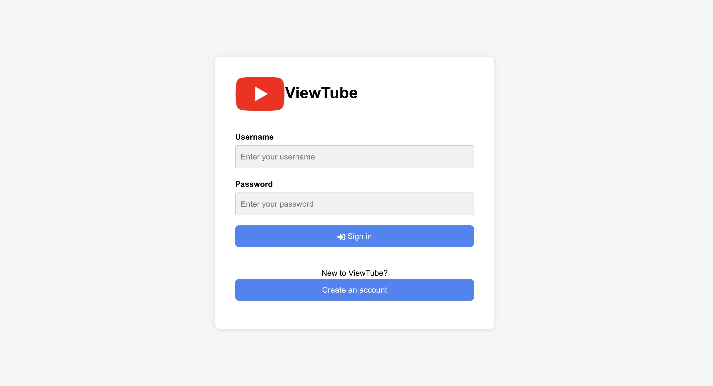
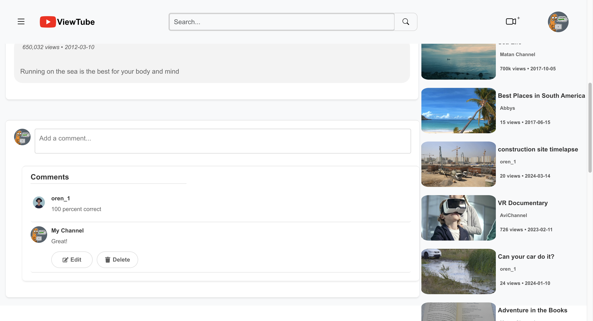

## Usage
### Register: Create a new account by filling out the registration form.

## Home Screen

The home screen is the central hub of ViewTube. Below are the key features and functionalities of the home screen:
By clicking on the brand logo from any page on our site you will be redirected to home page.
Search Bar: A search bar allows users to quickly find videos by entering keywords or phrases.
Navigation Links: Links to various sections, such as "Home," or "User Page," "Subscriptions," are available for easy access.

## User Registration
### Create an Account:

Visit the registration page and fill out the required fields (username, displayName, password).
Click the "Register" button to create your account.
Input Validation:
Ensure that your password meets the required criteria (e.g., Use at least 8 characters and one non-digit letter, add a profile picture).
Receive a feedback if your username or email is already taken.

### Login
Use your credentials to log in.

## User Account Menu

Profile Icon: Clicking on the user profile icon reveals a dropdown menu with options to view the user profile, access the user page, enabling dark mode, and log out.

## Manage Your Profile

Click on your profile icon to view and edit your account information (display name, profile pic).
Upload a profile picture to personalize your account.
View Your Activity and uploaded videos.

## Watch Videos
#### Browse through available videos and click on any video to start watching.
Click on any video thumbnail to open the video player.
Control playback with standard video player options (play, pause, volume control, fullscreen).
Like and Comment:
Express your opinions by liking videos and leaving comments for other users to see.

While watching a video, suggested videos related to the current content will appear, helping you find similar content.

